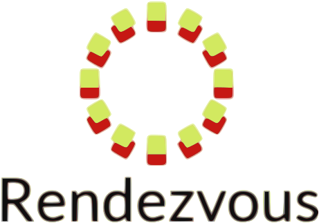

## About Rendezvour Project

> **Note:** this project is currently in development and is not ready
> for production yet.

A place where people can meet up together and collaborate ideas
on a variety of topics. This project is designed to fill the void where ideas both revolutionary and historic can co-exist without
being lost within all the noise.

Visit the projects GitHub account [rulin132/rendezvour](https://github.com/rulin132/rendezvous)

## License

The Rendezvour Project is open-sourced software licensed under the [MIT license](https://opensource.org/licenses/MIT).
